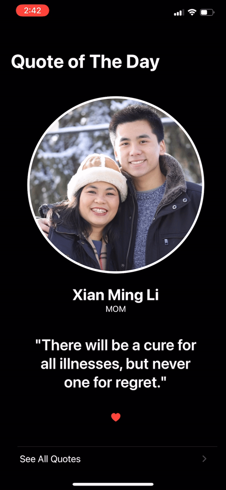

**<h1 align="center">iQuote</h1>**
# About the project
Quotes, you see them everywhere and the right one at the right time is just as good as a cup of coffee ☕️ . I built this project because quotes from the people I've encountered in my life and those I look up to constantly humbles and inspires me to work harder and accomplish my goals. I wanted a way to keep my favorite quotes close to me and what better way than to build a mobile app!  
Let's go through the User Experience, User Interface, and features of iQuote!    
**Disclaimer** All demos below feature red oval highlight over the time. This is not part of iQuote, but indication of screen recording as deployment and testing of iQuote was executed on a physical iphone XS MAX.  
 

# Overview
## Startup and Privacy Consent
   
After download and startup of iQuote, the user is greeted with the text *"work harder 🐢 "* while iQuote loads and launches its home screen. With a first download, iQuote asks for push notification permission. Allowing push notifications enables iQuote's feature that sends a quote as push notification to the device outside iQuote's environment at a user-desired time (I set my quote notification for when I wake up).   
**Note:** Push notification consent is only prompted once after initial download and notification settings are configurable in device settings.  
 

## Quote of The Day
   
When the user opens iQuote, iQuote launcnhes Quote of The Day that displays a randomly selected quote and accompanying deatils. The quote's **author, picture of author, author occupation, quote** are presented in a clean interface using VStack embedded within a NavigationView. 
- **TAP:** Want another quote? Simply ***tap*** anywhere on the screen to generate a new quote 😮 . 
- **❤️ :** ***tap*** the ❤️ to favorite the quote and save to Favorites. This feature allows user to save their favorite quotes and easily access their favorites (demo shown below). 
- **SCROLL:** Scrolling down presents the user with *"See All Quotes"* that transitions to a new View that displays all quotes. (see next section). 
 
## Quote List
   
iQuote is not limited to just  Quote of The Day, it features a host of Views that allow the user to explore a multitude of quotes and interact with each one. Quote List is accessed by tapping *"See All Quotes"* on the home Quote of The Day View. This feature displays a list of quotes, with each row formatted to present a quote and its information.
- **SCROLL *UP/DOWN*:** browse quotes by scrolling up and down 
- **TAP *Quote of The Day*:** return to main View -> Quote of The Day
- **TAP:** *tap* any quote in the list to view details.  
 
## Favorites ❤️
   
Like many things in life such as songs, we can resonate with and become attached to quotes and revisit them many times. With iQuote, you can save those quotes you love to a *Favorites* list by simply *tapping* the ❤️ -icon that accompanies each quote. Access this *Favorites* list by going to *Quote List* and sliding the *Show Favorites Only* to view only your favorites. summary of this feature listed below:
- **❤️ :** Quote is labelled as a favorite and will be featured in *Show Favorites Only* list
- **♡ :** Quote is not labelled as a favorite and can be found in the general *Quote List*
- **Show Favorites Only:** When toggled on (green), iQuote only displays favorited quotes. When toggled off, iQuote displays all quotes.  
 
# Technical Details 
## Technology Overiew
- iQuote is powered by **Swift** and developed on **Xcode 12.2**
- iQuote is designed with flexibility in mind such that it is compatible with all generations of iOS devices. 

## iQuote Views Overview
- **Home.swift:** View behind Quote of The Day that is shown when user visits iQuote -> selects random quote and displays data in *VStack* embeddded within *NavigationView*. Relies on **QuoteDetail.swift**. 
- **QuoteImage.swift:** View that formats author image and adds shadowing for contrast.  
    
- **QuoteDetail.swift:** View is responsible for obtaining quote details from supporting views and presenting a complete layout.   
    
 - **QuoteRow.swift:** View is responisble for formatting all quote inputs into row format. This View supports **QuoteList.swift** in displaying the list of quotes  
     
- **QuoteList.swift:** View presents a list of all quotes when user selects *"See All Quotes"*  
     
 

## Models
In conjuction to the many Views working together to provide iQuote user with a smooth and interactive interface, the data supplied to these Views are powered by robust models that processes JSON decoding, framework of iQuote data, intializes custom classes, object properties, and error handling.  
 

# Future Scope ( *"The biggest room in the world is the room for improvement"* - Helmut Schmidt )
- Design and add app icon.
- Support macOS, watchOS, iPadOS.
- Add support for fetching quote data from APIs.
- Add more user friendly feature such as background context of quote, additional information on author, SIRI dictation, etc. to improve user experience. 
